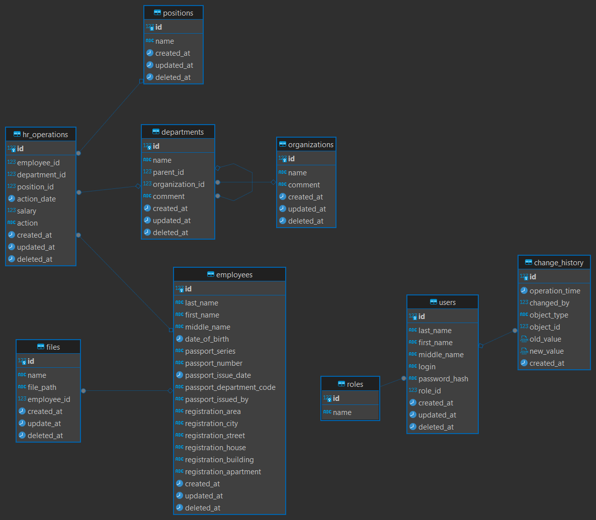

# База данных

## Структура базы данных



### Основные таблицы

#### organizations
Хранит информацию об организациях

| Поле | Тип данных | Описание |
|------|------------|----------|
| id | SERIAL | Уникальный идентификатор (PK) |
| name | VARCHAR(255) | Название организации |
| comment | TEXT | Комментарий |
| created_at | TIMESTAMP | Дата создания |
| updated_at | TIMESTAMP | Дата обновления |
| deleted_at | TIMESTAMP | Дата удаления |

#### departments
Хранит информацию об отделах

| Поле | Тип данных | Описание |
|------|------------|----------|
| id | SERIAL | Уникальный идентификатор (PK) |
| name | VARCHAR(255) | Название отдела |
| parent_id | INTEGER | ID родительского отдела (FK -> departments) |
| organization_id | INTEGER | ID организации (FK -> organizations) |
| comment | TEXT | Комментарий |
| created_at | TIMESTAMP | Дата создания |
| updated_at | TIMESTAMP | Дата обновления |
| deleted_at | TIMESTAMP | Дата удаления |

#### positions
Хранит информацию о должностях

| Поле | Тип данных | Описание |
|------|------------|----------|
| id | SERIAL | Уникальный идентификатор (PK) |
| name | VARCHAR(255) | Название должности |
| created_at | TIMESTAMP | Дата создания |
| updated_at | TIMESTAMP | Дата обновления |
| deleted_at | TIMESTAMP | Дата удаления |

#### roles
Хранит информацию о ролях пользователей

| Поле | Тип данных | Описание |
|------|------------|----------|
| id | SERIAL | Уникальный идентификатор (PK) |
| name | VARCHAR(50) | Название роли (уникальное) |

#### employees
Хранит информацию о сотрудниках

| Поле | Тип данных | Описание |
|------|------------|----------|
| id | SERIAL | Уникальный идентификатор (PK) |
| last_name | VARCHAR(255) | Фамилия |
| first_name | VARCHAR(255) | Имя |
| middle_name | VARCHAR(255) | Отчество |
| date_of_birth | DATE | Дата рождения |
| passport_series | VARCHAR(20) | Серия паспорта |
| passport_number | VARCHAR(20) | Номер паспорта |
| passport_issue_date | DATE | Дата выдачи паспорта |
| passport_department_code | VARCHAR(10) | Код подразделения |
| passport_issued_by | VARCHAR(255) | Кем выдан паспорт |
| registration_area | VARCHAR(255) | Область регистрации |
| registration_city | VARCHAR(255) | Город регистрации |
| registration_street | VARCHAR(255) | Улица регистрации |
| registration_house | VARCHAR(10) | Номер дома |
| registration_building | VARCHAR(10) | Строение |
| registration_apartment | VARCHAR(10) | Номер квартиры |
| created_at | TIMESTAMP | Дата создания |
| updated_at | TIMESTAMP | Дата обновления |
| deleted_at | TIMESTAMP | Дата удаления |

#### files
Хранит информацию о файлах

| Поле | Тип данных | Описание |
|------|------------|----------|
| id | SERIAL | Уникальный идентификатор (PK) |
| name | VARCHAR(255) | Имя файла |
| file_path | TEXT | Путь к файлу |
| employee_id | INTEGER | ID сотрудника (FK -> employees) |
| created_at | TIMESTAMP | Дата создания |
| update_at | TIMESTAMP | Дата обновления |
| deleted_at | TIMESTAMP | Дата удаления |

#### hr_operations
Хранит информацию о кадровых операциях

| Поле | Тип данных | Описание |
|------|------------|----------|
| id | SERIAL | Уникальный идентификатор (PK) |
| employee_id | INTEGER | ID сотрудника (FK -> employees) |
| department_id | INTEGER | ID отдела (FK -> departments) |
| position_id | INTEGER | ID должности (FK -> positions) |
| action_date | TIMESTAMP | Дата операции |
| salary | DECIMAL(10,0) | Зарплата |
| action | TEXT | Тип операции |
| created_at | TIMESTAMP | Дата создания |
| updated_at | TIMESTAMP | Дата обновления |
| deleted_at | TIMESTAMP | Дата удаления |

#### change_history
Хранит историю изменений

| Поле | Тип данных | Описание |
|------|------------|----------|
| id | SERIAL | Уникальный идентификатор (PK) |
| operation_time | TIMESTAMP | Время операции |
| changed_by | INTEGER | ID пользователя (FK -> users) |
| object_type | VARCHAR(50) | Тип объекта |
| object_id | INTEGER | ID объекта |
| old_value | JSONB | Старое значение |
| new_value | JSONB | Новое значение |
| created_at | TIMESTAMP | Дата создания |

#### users
Хранит информацию о пользователях системы

| Поле | Тип данных | Описание |
|------|------------|----------|
| id | SERIAL | Уникальный идентификатор (PK) |
| last_name | VARCHAR(255) | Фамилия |
| first_name | VARCHAR(255) | Имя |
| middle_name | VARCHAR(255) | Отчество |
| login | VARCHAR(255) | Логин (уникальный) |
| password_hash | TEXT | Хеш пароля |
| role_id | INTEGER | ID роли (FK -> roles) |
| created_at | TIMESTAMP | Дата создания |
| updated_at | TIMESTAMP | Дата обновления |
| deleted_at | TIMESTAMP | Дата удаления |

## Миграции

Система использует `node-pg-migrate` для управления миграциями. Основные команды:

```bash
# Создание новой миграции
npm run migrate:create name_of_migration

# Применение миграций
npm run migrate:up

# Откат миграций
npm run migrate:down
```

## Начальные данные

В системе предусмотрены seed-миграции для заполнения базы начальными данными:
- Создание ролей
- Создание дефолтного администратора
- Создание тестовых организаций
- Создание тестовых должностей
- Создание тестовых отделов
- Создание тестовых сотрудников
- Создание тестовых HR-операций
- Создание тестовых файлов
- Создание тестовых пользователей