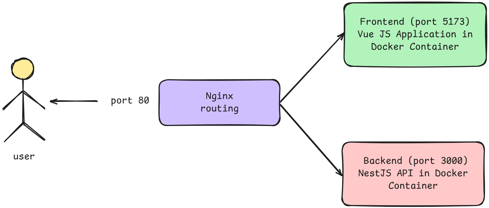

# Структура проекта

Проект разделен на три основные части:
- Frontend (app)
- Backend (api)
- Инфраструктура (containers)

## Frontend (app)

```
app/
├── src/
│   ├── assets/      # Статические ресурсы
│   ├── components/  # Vue компоненты
│   ├── router/      # Конфигурация маршрутизации
│   ├── services/    # Сервисы для работы с API
│   ├── stores/      # Хранилища Pinia
│   ├── views/       # Компоненты страниц
│   ├── App.vue      # Корневой компонент
│   └── main.js      # Точка входа
├── index.html       # HTML шаблон
├── vite.config.js   # Конфигурация Vite
└── package.json     # Зависимости и скрипты
```

## Backend (api)

```
api/
├── src/
│   ├── common/      # Общие утилиты и интерфейсы
│   ├── config/      # Конфигурация приложения
│   ├── decorators/  # Пользовательские декораторы
│   ├── modules/     # Модули приложения
│   ├── utils/       # Вспомогательные функции
│   ├── app.module.ts # Главный модуль приложения
│   └── main.ts      # Точка входа
├── migrations/      # Миграции базы данных
└── package.json    # Зависимости и скрипты
```

## Инфраструктура (containers)

```
containers/
├── nginx/          # Конфигурация веб-сервера
├── api/           # Dockerfile для backend
└── app/           # Dockerfile для frontend
```

## Схема работы через Nginx

1. Все запросы от клиента сначала поступают на Nginx
2. Nginx, выступая в роли прокси-сервера:
   - Перенаправляет запросы к `/api/*` на бэкенд-сервер
   - Отдает статические файлы фронтенда
   - Обеспечивает балансировку нагрузки




## Ключевые компоненты

### Frontend компоненты
- Навигационная панель
- Таблицы с данными
- Формы редактирования
- Модальные окна простотра детальной информации
- Компоненты загрузки файлов

### Backend сервисы
- Сервис аутентификации
- Сервис организаций
- Сервис должностей
- Сервис отделов
- Сервис сотрудников
- Сервис HR-операций
- Сервис файлов
- Сервис истории изменений 
- Сервис пользователей