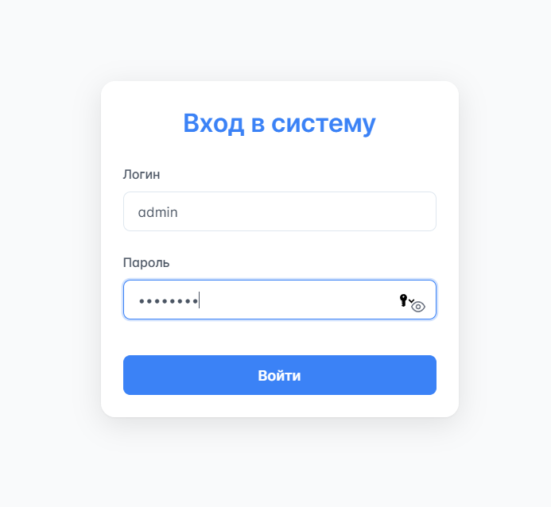
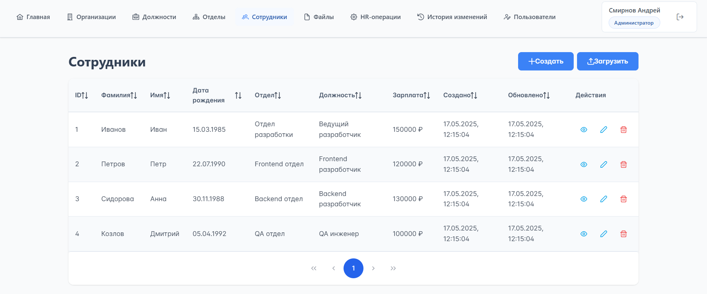
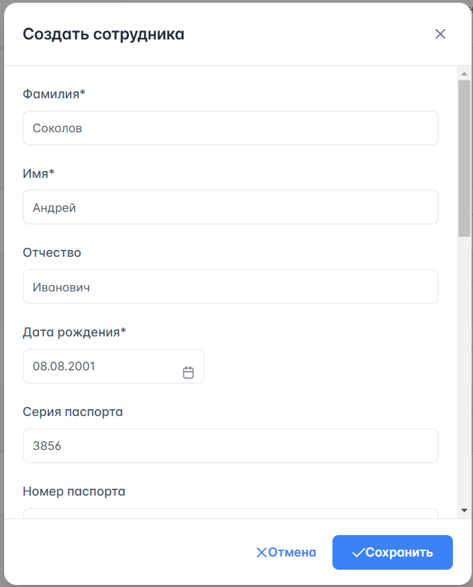
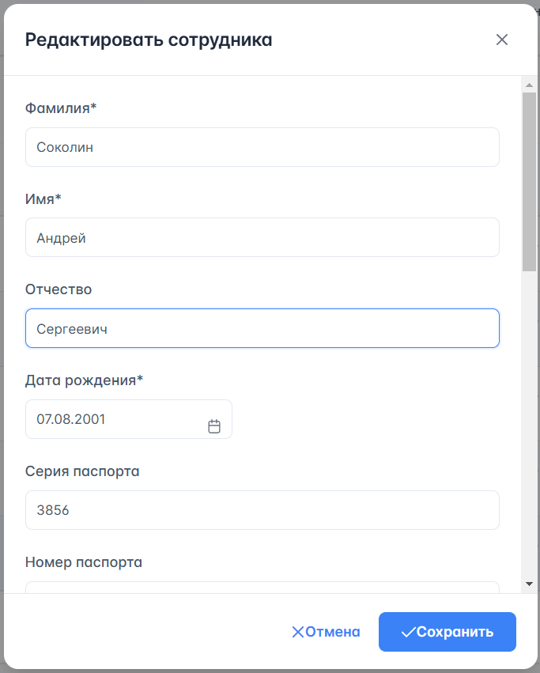
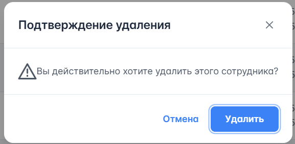
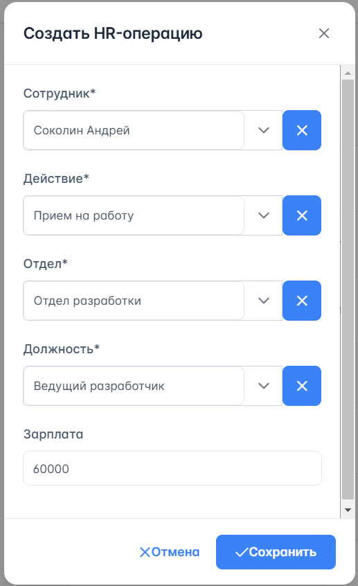
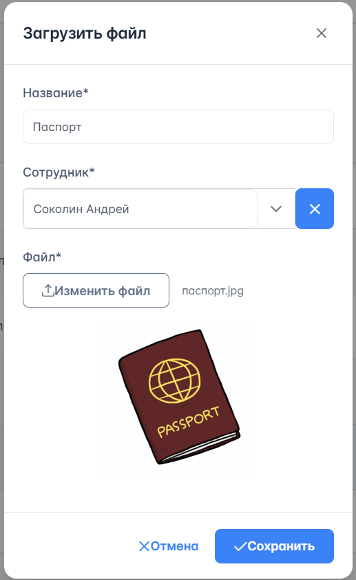
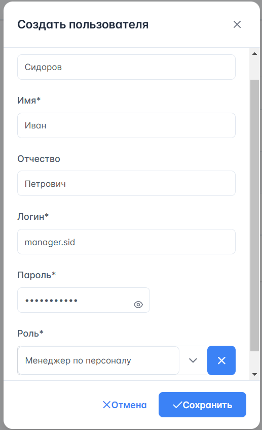
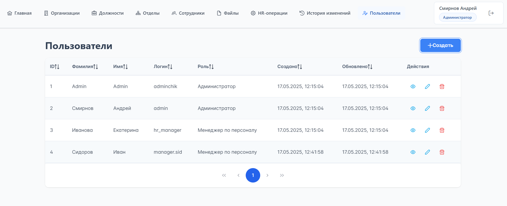
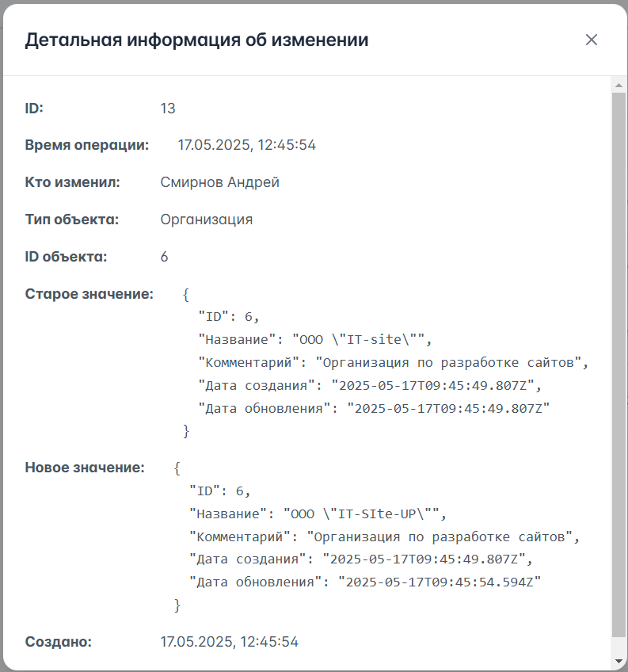

# Основные функции системы

## Вход в систему

1. Откройте приложение в браузере
2. На странице входа введите:
   - Логин
   - Пароль
3. Нажмите кнопку "Войти"

::: tip Роли пользователей
В системе существует два уровня доступа:
- Администратор (полный доступ ко всем функциям)
- Менеджер по персоналу (доступ к управлению сотрудниками и HR-операциям и т.д.)
:::

## Управление сотрудниками

### Просмотр списка сотрудников

1. В главном меню выберите раздел "Сотрудники"
2. Доступны функции:
   - Просмотр всех записей о сотрудниках
   - Сортировка по любому столбцу

### Добавление сотрудника

1. В разделе "Сотрудники" нажмите "Cоздать"
2. Заполните обязательные поля:
   - Фамилия
   - Имя
   - Отчество (опционально)
   - Дата рождения
3. При необходимости заполните паспортные данные (опционально):
   - Серия и номер
   - Дата выдачи
   - Код подразделения
   - Кем выдан
4. Укажите адрес регистрации (опционально):
   - Область
   - Город
   - Улица
   - Дом
   - Корпус
   - Квартира
5. Нажмите "Сохранить"

### Редактирование сотрудника

1. В списке сотрудников найдите нужного сотрудника
2. Нажмите кнопку редактирования
3. Внесите необходимые изменения
4. Нажмите "Сохранить"

### Удаление сотрудника

1. В списке сотрудников найдите нужного сотрудника
2. Нажмите кнопку удаления (значок корзины)
3. Подтвердите действие в диалоговом окне

::: warning Особенности удаления
- Удаление записей в системе является "мягким" - записи помечаются как удаленные, но физически остаются в базе данных
- Информация об удалении сохраняется в истории изменений
- Удаленные записи не отображаются в основных списках
:::

::: tip Работа с другими разделами
Все основные операции в других разделах системы (организации, отделы, должности и т.д) выполняются аналогичным образом:

- **Просмотр списка**: сортировка, просмотр
- **Создание**: форма с необходимыми полями
- **Редактирование**: изменение существующих данных
- **Удаление**: "мягкое" удаление с подтверждением
:::

## HR-операции

### Типы операций

В системе доступны следующие HR-операции:
- Прием на работу
- Перевод
- Увольнение
- Изменение зарплаты

### Создание HR-операции

1. Нажмите "Создать"
2. Выберите сотрудника из списка
3. Выберите тип операции
4. Заполните необходимые поля:
   - Для приема: отдел, должность, зарплата
   - Для перевода: новый отдел и/или должность, новая зарплата
   - Для изменения зарплаты: новая зарплата
   - Для увольнения: только выбранный сотрудник
5. Подтвердите операцию

::: tip Примечание
В HR-операциях создают новые записи, а не изменяют существующие, что позволяет сохранять полную историю кадровых изменений
:::

## Работа с файлами

### Загрузка файлов

Загрузить документы можно двумя способами:

**Через раздел сотрудников:**
1. В разделе сотрудников выберите строку с нужным сотрудником
2. Нажмите "Загрузить"
3. Введите название файла
4. Выберите файл для загрузки
5. Файл будет привязан к сотруднику

**Через раздел файлов:**
1. Перейдите в раздел "Файлы"
2. Нажмите "Загрузить"
3. Введите название файла
4. Выберите сотрудника из выпадающего списка
5. Выберите файл для загрузки
6. Файл будет привязан к выбранному сотруднику

### Управление файлами

- Просмотр списка файлов сотрудников
- Скачивание файлов

## Управление пользователями (только для администраторов)

### Создание пользователя

1. В разделе "Пользователи" нажмите "Добавить"
2. Заполните данные:
   - Фамилия
   - Имя
   - Отчество (опционально)
   - Логин
   - Пароль
   - Роль (Администратор/Менеджер)
3. Нажмите "Сохранить"

### Управление пользователями

- Просмотр списка пользователей
- Редактирование данных пользователей

## История изменений

Система автоматически ведет журнал всех изменений:
- Изменения данных сотрудников, должностей, организаций и т.д
- HR-операции
- Операции с документами
- Действия с пользователями

### Просмотр истории

1. Доступ к истории изменений из карточки на домашней странице или на вкладке в верхнем меню:
2. В записях истории отображается:
   - Дата и время изменения
   - Тип операции
   - Пользователь, выполнивший действие
   - Старые и новые значения полей

